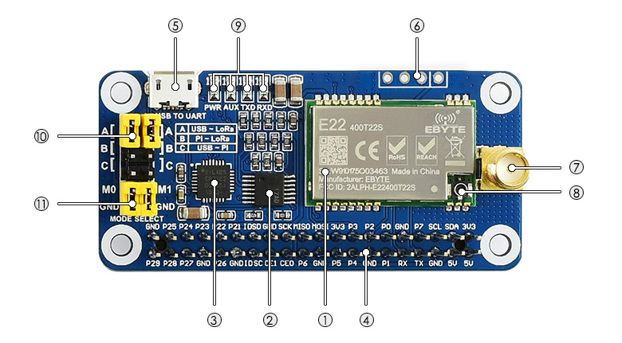

# team-communication
## Team 2

Lora Module: https://www.waveshare.com/wiki/SX1262_868M_LoRa_HAT

## Installation on RPi:

1) Install python serial:
```
#sudo apt install python-serial
sudo raspi-config
cd Documents
wget https://files.waveshare.com/upload/1/18/SX126X_LoRa_HAT_CODE.zip
unzip SX126X_LoRa_HAT_CODE.zip
```
2) Enable serial port:
```
sudo raspi-config
```
-> Interfacing Options -> Serial -> No -> Yes

## Set Jumpers

10: UART selection jumpers
- A: control the LoRa module through USB TO UART
- B: control the LoRa module through Raspberry Pi
- C: access Raspberry Pi through USB TO UART
11: LoRa mode selection jumpers
- short M0, short M1: transmission mode
- short M0, open M1: configuration mode
- open M0, short M1: WOR mode
- open M0, open M1: deep sleep mode